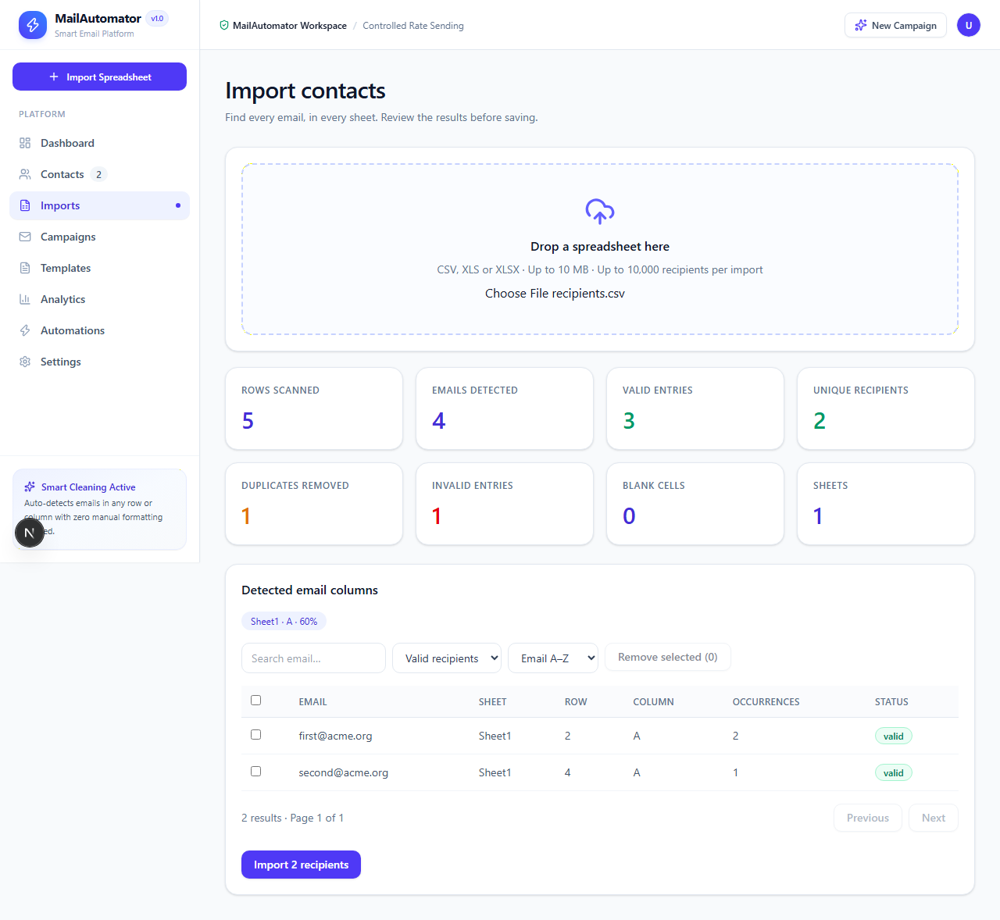
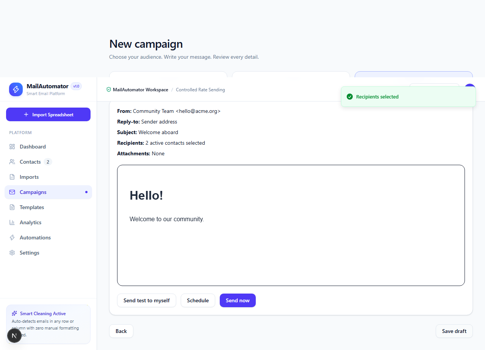

# MailAutomator

A Next.js application for turning messy spreadsheets into reviewed contact lists, writing email campaigns, and delivering individual messages through a persistent queue.

The project implements the spreadsheet engine, contact/group management, rich-text composer, templates, scheduled delivery, provider webhooks, campaign analytics, and multi-step workflows from Phases 2�7. Phase 8 includes security hardening, tests, documentation and deployment configuration. Live cloud provisioning and production validation require your Supabase, Resend and hosting accounts.

## Get started

```sh
npm ci
```

Copy `.env.example` to `.env.local`, fill in the Supabase public and service-role keys, set the application URL, and generate the encryption and cron secrets. For a new database, apply `supabase/schema.sql` once, then every numbered migration in `supabase/migrations/`. If Phase 1 is already deployed, apply only the migrations.

```sh
npm run dev
```

Open http://localhost:3000 and sign up. Add a Resend key, webhook secret, and verified sender in Settings. Existing accounts can add the five starter templates from the template library.

Sending requires the scheduled worker. Configure an external scheduler or use the included Vercel cron to call `GET /api/jobs` every minute with `Authorization: Bearer CRON_SECRET`. The Send button queues work durably; it does not launch an unreliable detached request.

## Included

- Multi-sheet CSV/XLS/XLSX parsing in a Web Worker, confidence scores, strict validation, source tracking, deduplication, and recipient review.
- Paginated contacts, import history, groups, bulk actions, manual additions, and formula-safe CSV exports.
- TipTap editor, starter/custom templates, private attachments, preview, drafts, tests, schedules and confirmation before sending.
- Resend delivery with verified identities, encrypted user keys, atomic queue claims, stable idempotency keys, bounded retries and suppression.
- Delivery reports, live progress, historical charts, and SQL-aggregated analytics.
- Form-based workflows with email, wait, and condition steps; manual/import/scheduled enrollment; pause and recovery.
- Authenticated and ownership-checked APIs, server-side HTML sanitization, persistent rate limits, strict mutation origin checks, RLS and service-only mutations.

## Stack

Next.js 16 App Router, React 19, TypeScript, Tailwind CSS 4, shadcn/Radix UI, Supabase Auth/Postgres/Storage, SheetJS, TipTap, Resend, Recharts, Vitest, PGlite and Playwright. Node.js 22.12+ recommended.

## Checks

```sh
npm test
npm run typecheck
npm run lint
npm run build
npx playwright install chromium
npm run test:e2e
```

Unit tests exercise parsing, malformed addresses, 10,000-row workbooks, sanitization, encryption and retry policy. PostgreSQL integration tests apply the actual migrations in PGlite and exercise import ? campaign ? queue ? delivery, tenant isolation, webhook ordering and workflow progression. Browser tests cover public navigation and auth/API boundaries. The authenticated import-to-draft browser test runs when `E2E_EMAIL` and `E2E_PASSWORD` are configured; tests do not send real emails.

## Project layout

- `app/(dashboard)`: workspace routes.
- `components/platform`: data-backed screens; `components/email` and `components/charts`: lazy-loaded editors and charts.
- `app/api`: authenticated resource, analytics, attachment, worker and webhook endpoints.
- `lib/spreadsheet`, `lib/email`, `lib/automation`: processing engines.
- `lib/server`: validation, authorization, encryption and resource handlers.
- `supabase/migrations`: transactional jobs, security and reporting additions to Phase 1.
- `tests`: unit, database integration and browser checks.

## Documentation

- [Deployment and operations](docs/DEPLOYMENT.md)
- [User guide](docs/USER_GUIDE.md)
- [API reference](docs/API.md)
- [Contributing](CONTRIBUTING.md)
- [Sample spreadsheet](docs/sample-contacts.csv)

Imports and campaigns support up to 10,000 recipients; files and total campaign attachments are capped at 10 MB. Worker throughput is bounded by a single global lease and configured provider rate. Each workflow enrolls a contact once; scheduled runs pick up newly eligible contacts. Billing is intentionally a future placeholder. Production delivery, domain verification, OAuth, and uptime monitoring must be checked in the deployed environment.

## Screenshots

Browser-tested screens below use local fixture data.




See [implementation status](docs/IMPLEMENTATION_STATUS.md) for completed scope, operating limits, and the remaining production setup.
